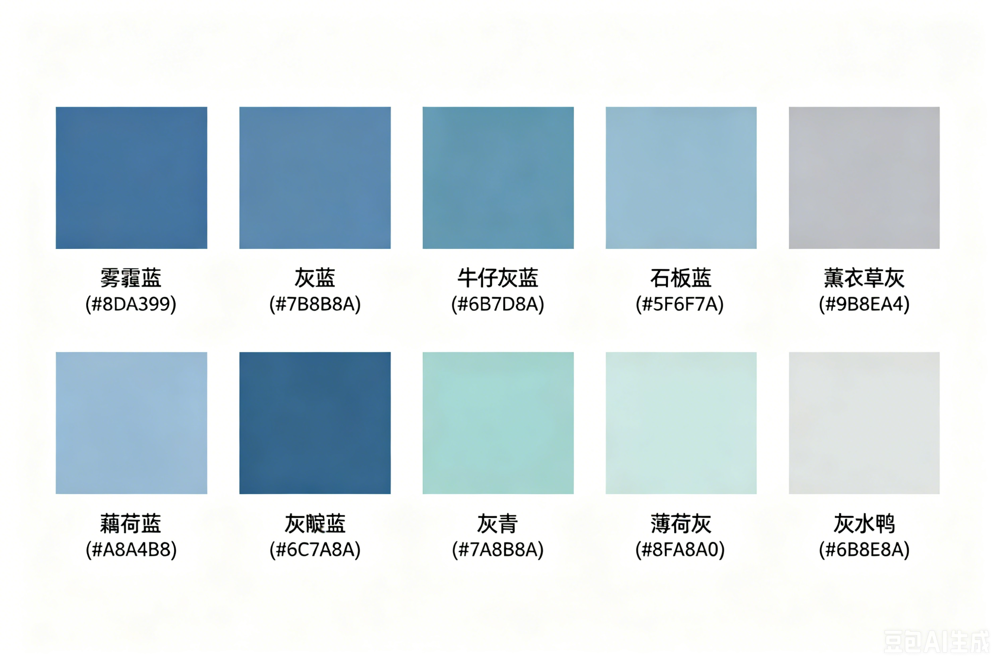

其他字体都默认

标题字体都用VT323

hobby页面全是VT323


整体色系



偏蓝的莫兰迪色系，特点是**低饱和度、带灰调、柔和安静**。以下是几组实用配色：

---

### 经典蓝灰调

| 色名     | Hex         | 感觉                     |
| -------- | ----------- | ------------------------ |
| 雾霾蓝   | `#8DA399` | 灰绿偏蓝，最经典的莫兰迪 |
| 灰蓝     | `#7B8B8A` | 中性偏冷，百搭           |
| 牛仔灰蓝 | `#6B7D8A` | 偏深蓝灰，沉稳           |
| 石板蓝   | `#5F6F7A` | 再深一度，适合标题或边框 |

---

### 偏紫的冷蓝

| 色名     | Hex         | 感觉               |
| -------- | ----------- | ------------------ |
| 薰衣草灰 | `#9B8EA4` | 紫灰偏蓝，温柔     |
| 藕荷蓝   | `#A8A4B8` | 浅紫灰，很淡很高级 |
| 灰靛蓝   | `#6C7A8A` | 靛蓝褪饱和，现代感 |

---

### 偏绿的蓝灰

| 色名   | Hex         | 感觉             |
| ------ | ----------- | ---------------- |
| 灰青   | `#7A8B8A` | 青灰，东方感     |
| 薄荷灰 | `#8FA8A0` | 薄荷褪饱和，清新 |
| 灰水鸭 | `#6B8E8A` | 深一点，有质感   |

---

## Hobby 页面 — 添加新爱好的模板

在 `hobby.html` 的 `<div class="trophy-grid">` 里，复制下面这段，改三个地方：

```html
<div class="trophy-card">
  <div class="trophy-icon">
    <svg viewBox="0 0 64 64" width="64" height="64">
      <rect x="4" y="4" width="56" height="56" rx="8" fill="var(--trophy-bg)" stroke="var(--trophy-border)" stroke-width="3"/>
      <text x="32" y="42" text-anchor="middle" font-size="30">🎯</text>
    </svg>
  </div>
  <div class="trophy-name">爱好名称</div>
  <div class="trophy-desc">一句话描述</div>
</div>
```

### 需要改的三处：

1. **`🎯`** — 换一个 emoji（在 `font-size="30"` 前面）
2. **`爱好名称`** — 例如 `Jazz Music`
3. **`一句话描述`** — 例如 `Laufey!!! I like her.`

### 注意事项：

- 新增卡片后，如果超过 5 个，去 `style.css` 搜索 `nth-child` 把动画延迟补齐（每多一个加 `0.5s`）
- emoji 推荐像素风兼容的：🎷🎸🎹🎺🥁🎻🏔️⛰️🏄🏊🚴🎿📜📖🎮🕹️🐰🌟⚡🔥
